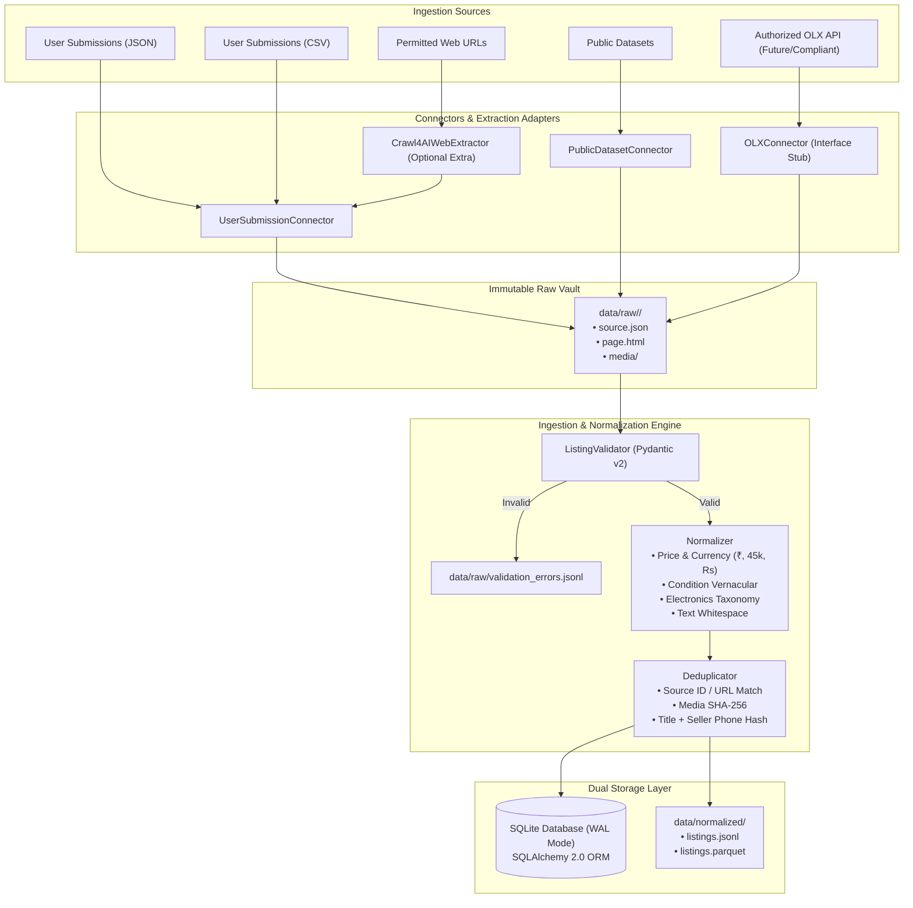
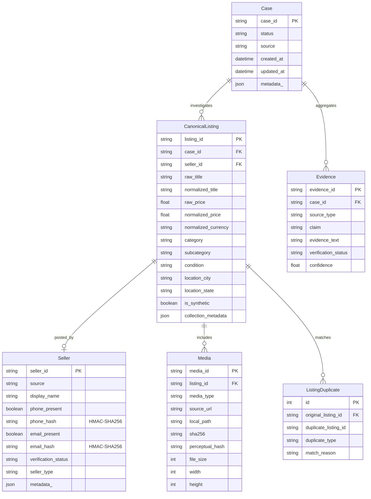

# TrustLens — Marketplace Fraud Intelligence

[](https://www.python.org/downloads/)
[](https://github.com/astral-sh/ruff)
[](https://mypy.readthedocs.io/)
[](LICENSE)

> **Research-grade, open-source marketplace fraud intelligence foundation.**  
> Investigating online marketplace risk through structured signals, multi-modal evidence, and explainable intelligence.

---

## 1. Problem Statement

Secondary online marketplaces (e.g. OLX, Facebook Marketplace, Craigslist, Quikr) suffer from persistent risks of deception: counterfeit electronics, fraudulent advance-payment demands, non-existent inventory, stolen product images, and fabricated seller claims. Today, buyers must manually guess whether a listing or seller is genuine.

Current platform moderation relies largely on post-facto account bans and brittle keyword filters that fail against coordinated fraudsters rotating disposable accounts and relisting duplicate media.

## 2. The TrustLens Vision

**TrustLens** is building an evidence-based marketplace fraud intelligence system that collects, normalizes, inspects, and analyzes listing claims against cross-source evidence.

By integrating:
* Structured listing analysis & canonical normalization
* Privacy-conscious seller entity signals & cross-listing clustering
* Computer vision, perceptual image hashing & duplicate detection
* OCR, NLP claim extraction & discrepancy detection
* Web evidence retrieval & evidence graph reasoning
* Explainable risk assessment (never opaque black-box verdicts)

TrustLens empowers researchers, consumers, and platforms to verify marketplace transactions objectively.

---

## 3. Current Status: Phase 1 — Data Ingestion Foundation

We are currently in **Phase 1**. The goal of Phase 1 is **not** to train fraud prediction models, build AI agents, or run vector databases, but to construct a **bulletproof, production-style data ingestion foundation**:

* Source-agnostic canonical schema (`CanonicalListing`, `Seller`, `Media`, `Case`, `Evidence`)
* Zero raw data loss (raw payloads preserved immutably in `data/raw/<case_id>/`)
* Fault-tolerant validation (malformed entries routed to `validation_errors.jsonl` without halting batches)
* Deterministic normalization (multi-format Indian/global prices, condition vernacular, category taxonomy)
* Privacy-by-design (salted `HMAC-SHA256` hashing for seller identifiers; no raw PII in logs or storage)
* Dual storage (transactional SQLite via SQLAlchemy ORM + analytical Parquet/JSONL)
* Deterministic deduplication (source ID, URL, media SHA-256, normalized title + seller phone hash)
* Modular CLI & observability tooling

---

## 4. System Architecture



---

## 5. Core Data Model

TrustLens models are built with **Pydantic v2** and mapped relationally with **SQLAlchemy 2.0 ORM**:



---

## 6. Privacy & Ethics Safeguards

TrustLens enforces strict privacy protections throughout its architecture:
1. **Never Storing Raw PII**: Customer telephone numbers and email addresses are never saved in plaintext or output in log files.
2. **Deterministic Salted Hashes**: Identifiers are normalized and hashed using `HMAC-SHA256` with a secret salt (`HASH_SALT`). This prevents rainbow-table recovery while enabling duplicate seller clustering.
3. **No Scraping Without Permission**:
   - Automated mass scraping of OLX India is prohibited by platform Terms of Service.
   - TrustLens provides an `OLXConnector` interface for official API partner credentials or user-authorized listing exports, not an active mass scraper.
   - Web extraction via Crawl4AI is decoupled and restricted to authorized or user-submitted URLs.
4. **Git Protection**: `data/raw/`, `data/normalized/`, `data/processed/`, and `data/labels/` are strictly excluded in `.gitignore`. Real user data is never committed to Git.

---

## 7. Electronics Taxonomy

Phase 1 focuses on high-risk electronics categories:

```text
Electronics
├── Smartphones
│   ├── iPhone, Samsung, OnePlus, Google Pixel, Xiaomi, Other
├── Gaming
│   ├── PlayStation, Xbox, Nintendo Switch, GPU, Gaming PC
├── Cameras
│   ├── DSLR, Mirrorless, Lens, Action Camera
├── Laptops
│   ├── MacBook, Windows Laptop, Gaming Laptop
└── Audio & Wearables
    ├── AirPods, Headphones, Earbuds, Smartwatch
```

Taxonomy and keyword aliases are fully configurable in `src/trustlens/config/categories.py`.

---

## 8. Quickstart Guide

### Prerequisites
* Python 3.11 or higher
* Virtual environment (`venv`)

### Installation

```bash
# 1. Clone repository
git clone https://github.com/your-username/trustlens.git
cd trustlens

# 2. Create and activate virtual environment
python3 -m venv .venv
source .venv/bin/activate

# 3. Install in editable mode with dev dependencies
pip install -e ".[dev]"

# (Optional) If you plan to crawl permitted URLs using Crawl4AI:
# pip install -e ".[web]"
```

### Environment Configuration

```bash
cp .env.example .env
```

---

## 9. CLI Usage

TrustLens provides a CLI powered by Typer and Rich.

### 1. Ingest Synthetic JSON Dataset
```bash
trustlens ingest --file examples/synthetic_listings.json
```

### 2. Ingest CSV Listings
```bash
trustlens ingest --csv examples/synthetic_listings.csv
```

### 3. Validate Listings (Dry Run)
```bash
trustlens validate --file examples/synthetic_listings.json
```

### 4. Preview Normalization Transformations
```bash
trustlens normalize --file examples/synthetic_listings.json --limit 3
```

### 5. View Ingestion Statistics
```bash
trustlens stats
```

Output:
```text
    TrustLens Marketplace Intelligence — Database Statistics    
┏━━━━━━━━━━━━━━━━━━━━━━━━━━━━━━━━━━━━━┳━━━━━━━━━━━━━━━━━━━━━━━━┓
┃ Metric                              ┃ Count / Breakdown      ┃
┡━━━━━━━━━━━━━━━━━━━━━━━━━━━━━━━━━━━━━╇━━━━━━━━━━━━━━━━━━━━━━━━┩
│ Total Listings Ingested             │ 30                     │
│ Synthetic Listings                  │ 30                     │
│ Listings by Category                │ • Audio & Wearables: 5 │
│                                     │ • Cameras: 6           │
│                                     │ • Gaming: 7            │
│                                     │ • Laptops: 4           │
│                                     │ • Smartphones: 8       │
│ Listings by Source                  │ • user_submission: 30  │
│ Listings with Images                │ 24                     │
│ Listings with Videos                │ 0                      │
│ Missing Descriptions                │ 1                      │
│ Missing Prices                      │ 1                      │
│ Duplicate Listings Detected         │ 2                      │
│ Logged Validation Errors            │ 0                      │
└─────────────────────────────────────┴────────────────────────┘
```

---

## 10. Running Tests & Code Quality

```bash
# Run pytest test suite (28 unit & e2e integration tests)
pytest -v

# Run static type checking
mypy src/trustlens

# Run linter and formatter checks
ruff check .
ruff format --check .
```

---

## 11. Project Roadmap

```text
[✓] Phase 1  — Data Ingestion Foundation (Canonical schema, Normalizer, Deduplication, SQLite/Parquet)
[ ] Phase 2  — Data Cleaning & Human Annotation Studio
[ ] Phase 3  — Multimodal Feature Extraction (OCR, Perceptual Visual Embeddings, EXIF)
[ ] Phase 4  — Baseline Fraud & Anomaly Detection Models
[ ] Phase 5  — Evaluation Benchmark & Metric Tracking
[ ] Phase 6  — Web Evidence Retrieval & Cross-Reference RAG
[ ] Phase 7  — Entity & Evidence Graph Construction
[ ] Phase 8  — Autonomous Investigation Agent
[ ] Phase 9  — API Service & Interactive Fraud Dashboard
[ ] Phase 10 — Official Authorized Marketplace Platform Integration
```

---

## License

This project is licensed under the Apache 2.0 License. See [LICENSE](LICENSE) for details.
