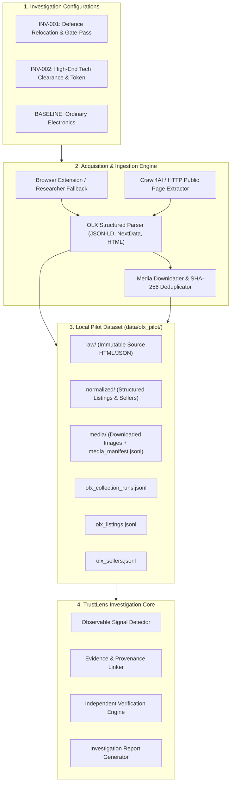

# TRUSTLENS — PHASE 3: TARGETED OLX MARKETPLACE ACQUISITION & INVESTIGATION DESIGN

## 1. Executive Summary & Objective

**Phase 3** bridges the empirical findings of the **Phase 2 Reddit Multimodal Research** into **Targeted OLX Marketplace Acquisition & Controlled Investigation**.

The Reddit multimodal research established:
* 178 raw cases (157 filtered Indian marketplace fraud reports)
* Top product categories: Smartphone (52), Laptop (38), Gaming Console (22), Vehicle (18), Camera (12)
* Top fraud mechanisms: `advance_payment` (68), `unrealistic_price` (51), `whatsapp_migration` (48), `upi_payment` / `qr_payment` (42), `army_persona` / `cisf_persona` (24), `fake_invoice` / `canteen_receipt` (21)
* Core fraud journeys: `FJ-001` (Army Relocation & Gate-Pass Trap), `FJ-002` (QR Reverse-Charge Trap)

The objective of Phase 3 is **targeted discovery and controlled evidence acquisition on OLX**:
```text
REDDIT FRAUD INTELLIGENCE
        ↓
TARGETED SEARCH HYPOTHESES (INV-001, INV-002, BASELINE)
        ↓
CONTROLLED OLX DISCOVERY
        ↓
LISTING & FULL PAGE COLLECTION
        ├── Product attributes
        ├── Seller profile details
        ├── Price, currency, location
        └── Description & contact claims
        ↓
MEDIA DOWNLOAD & SHA-256 DEDUPLICATION
        ↓
LOCAL REPRODUCIBLE OLX DATASET (data/olx_pilot/)
        ↓
INVESTIGATION EVIDENCE & SIGNAL VERIFICATION
```

---

## 2. Scope Boundaries & Compliance

### Compliance Principles
1. **Lawful & Authorized Retrieval**: Uses Crawl4AI / standard HTTP retrieval for permitted public pages without bypassing CAPTCHA, bot protections, or rate limits.
2. **Researcher-Assisted Fallback**: Supports local browser extension capture and manual HTML ingestion (`trustlens olx ingest --html ...`).
3. **No Speculative Scraping**: Strictly targeted queries based on investigation hypotheses. No mass scraping of private chats, phone calls, or off-platform WhatsApp messages.
4. **No Premature Labeling**: Listings and sellers are NEVER automatically classified as "scams" or given "fraud probabilities" during acquisition.

---

## 3. Architecture Overview



---

## 4. Core Data Schemas

### 4.1. `OLXListing`
Captures normalized listing, product, seller, media, claims, and discovery context:
```json
{
  "listing_id": "OLX-000001",
  "source": "olx",
  "source_listing_id": "1804291823",
  "listing_url": "https://www.olx.in/item/...",
  "investigation_id": "INV-002",
  "collection_type": "targeted",
  "title": "MacBook Pro M2 16GB 512GB - Company Clearance",
  "description": "Urgent sale due to office closing. WhatsApp on 98xxxxxxxx...",
  "category": "laptops",
  "subcategory": "macbook",
  "price": 35000.0,
  "currency": "INR",
  "location": "Koramangala, Bangalore",
  "posted_at": "2026-09-18T10:00:00Z",
  "product": {
    "brand": "Apple",
    "model": "MacBook Pro M2",
    "condition": "used_like_new",
    "storage": "512GB",
    "ram": "16GB"
  },
  "seller": {
    "seller_id": "SELLER-OLX-8291",
    "display_name": "Tech Surplus Hub",
    "location": "Bangalore",
    "account_age": "Member since Aug 2026",
    "verification_badges": ["phone_verified"]
  },
  "media": [
    {
      "media_id": "MEDIA-OLX-000001-001",
      "source_url": "https://img.olx.in/...",
      "local_path": "media/MEDIA-OLX-000001-001.webp",
      "sha256": "e3b0c44298fc1c149afbf4c8996fb92427ae41e4649b934ca495991b7852b855"
    }
  ],
  "claims": [
    {"claim_id": "CLM-001", "text": "Office closing clearance", "source": "description"},
    {"claim_id": "CLM-002", "text": "WhatsApp contact requested", "source": "description"}
  ],
  "discovery_context": {
    "investigation_id": "INV-002",
    "query": "MacBook warehouse",
    "run_id": "OLX-RUN-20260920-001",
    "discovered_at": "2026-09-20T18:00:00Z"
  }
}
```

---

## 5. Investigation Suites

| Investigation ID | Focus / Journey | Target Categories | Target Search Queries | Baseline Queries |
| :--- | :--- | :--- | :--- | :--- |
| **`INV-001`** | **Defence / Army Relocation & Gate-Pass** | Cars, Bikes, Laptops, Smartphones | `"army officer urgent sale"`, `"army transfer"`, `"cisf transfer"`, `"army canteen"`, `"gate pass"`, `"transport fee"` | `"used car"`, `"used bike"`, `"used laptop"`, `"used iphone"` |
| **`INV-002`** | **High-End Tech Clearance & Booking Token** | Smartphones, Laptops, Gaming Consoles | `"iphone cheap"`, `"iphone clearance"`, `"macbook cheap"`, `"macbook warehouse"`, `"ps5 cheap"`, `"ps5 clearance"`, `"gaming laptop cheap"` | `"iphone 15"`, `"macbook pro"`, `"ps5"`, `"gaming laptop"` |
| **`BASELINE`** | **Standard Electronics Baseline** | Smartphones, Laptops, Gaming Consoles | Category browse queries without suspicious triggers | Standard model queries |

---

## 6. CLI Command Suite

```bash
# 1. Run full targeted investigation acquisition run
trustlens olx run --investigation INV-002 --max-results 20

# 2. Discover listings for a specific query
trustlens olx discover --investigation INV-002 --query "MacBook warehouse" --limit 20

# 3. Collect & parse discovered listings
trustlens olx collect --run-id OLX-RUN-20260920-001

# 4. Ingest single URL or researcher-saved HTML
trustlens olx ingest --url "https://www.olx.in/item/..." --investigation INV-002
trustlens olx ingest --html path/to/listing.html --investigation INV-001

# 5. Check run status & export dataset
trustlens olx status OLX-RUN-20260920-001
trustlens olx export --run-id OLX-RUN-20260920-001 --output-dir data/olx_pilot/export/

# 6. Generate investigation report
trustlens olx report OLX-000001
```
