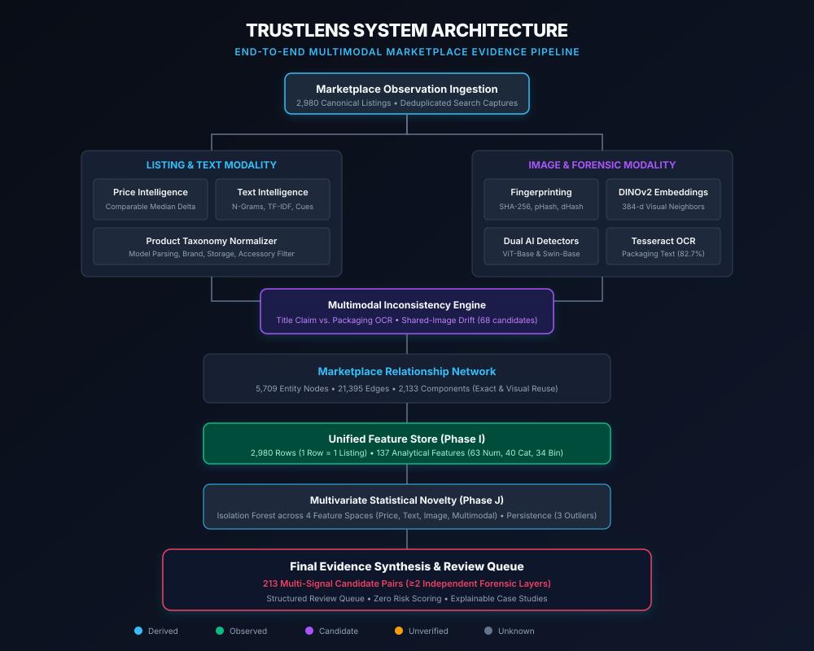

# TrustLens — Multimodal Marketplace Fraud Intelligence

> **An evidence-first research system for investigating suspicious marketplace listings using price analysis, text intelligence, image reuse, OCR, visual similarity, multimodal consistency, relationship graphs, and statistical novelty detection.**

[](#research-pipeline)
[](#dataset)
[](#dataset)
[](#multimodal-evidence)
[](#engineering-rigor)

---

## Architecture Overview



---

## Why I Built This

A few months ago, I lost ₹23,000 to an online classifieds deposit scam when attempting to buy a second-hand gadget. The listing had realistic photos, clean pricing, and responsive communication, but once the deposit was wired, the listing disappeared.

When I explored how online marketplaces combat this, I noticed a fundamental flaw in traditional approaches: most systems attempt to train a black-box binary classifier that outputs a "scam score" (e.g. *"94% Scam Probability"*). 

In reality, online marketplaces suffer from a complete absence of ground-truth fraud labels at the moment of listing creation. Black-box scores generate high false positive rates, fail to explain *why* an item is flagged, and leave human trust & safety investigators with no actionable evidence.

I built **TrustLens** to demonstrate an alternative paradigm: **Evidence-First Intelligence**. Instead of guessing whether a listing is fraudulent, TrustLens extracts independent, orthogonal forensic observations across price, text, vision, packaging OCR, and graph relationships—turning fragmented marketplace listings into structured, explainable evidence.

---

## The Problem

Peer-to-peer e-commerce platforms (such as OLX, Craigslist, and Facebook Marketplace) face severe challenges:
1. **Multimodal Contradictions:** A seller declares an "iPhone 13 128GB" in the title, but the packaging photo displays an "iPhone 13 Mini".
2. **Cross-City Image Duplication:** Deceptive syndicates duplicate the same product photo across dozens of listings in different cities to harvest advance deposits.
3. **Single-Detector AI Fragility:** Generic AI image detectors trigger false alarms on compressed e-commerce photos. In our benchmarks, two leading vision transformers disagreed on **24.5% of marketplace images**.
4. **Keyword & Price Heuristic Failures:** Legitimate sellers offering damaged units or phone cases get falsely flagged by naive price discount rules.

---

## What TrustLens Does

TrustLens ingests public marketplace listings and evaluates them across a multi-stage forensic pipeline:
* **Product Normalization:** Parses unconstrained titles into standardized models and benchmarks prices against comparable-product medians.
* **Dual-Track Visual Forensics:** Detects exact binary image reuse (SHA-256) and semantic visual similarity across camera angles using 384-dimensional DINOv2 embeddings.
* **Packaging OCR Verification:** Extracts visible text strings from packaging boxes and screens with Tesseract 5.5, identifying cross-modal discrepancies.
* **Dual-Detector AI Consensus:** Benchmarks images through ViT-Base and Swin-Base architectures, requiring mutual agreement before flagging candidates.
* **Relationship Graph Topology:** Constructs a 5,709-node network that clusters listings by shared images, text, and OCR phrases.
* **Unsupervised Novelty Detection:** Models statistical outliers across 4 feature spaces using Isolation Forest within a 137-column feature store.
* **Multi-Signal Synthesis:** Compiles candidate pairs into an investigator review queue ranked by integer counts of independent forensic layers.

---

## Research Pipeline

The TrustLens research pipeline executed sequentially across eleven frozen stages:

| Phase | Core Objective | Key Output / Metric | Status |
| :--- | :--- | :--- | :---: |
| **Phase A** | Data Ingestion & Integrity Audit | 2,980 listings deduplicated; zero duplicate IDs | FROZEN |
| **Phase B** | Product Normalization & Price Baselines | Model-specific medians; $\le -35\%$ discount flags | FROZEN |
| **Phase C** | Image Fingerprinting & Hash Clusters | 164 SHA-256 reuse pairs; 78 pHash candidates | FROZEN |
| **Phase D** | DINOv2 Deep Visual Embeddings | 9,492 dense visual relationships ($\ge 0.70$ cosine) | FROZEN |
| **Phase E** | Multimodal Packaging OCR Consistency | 68 inconsistency candidates (66 drift, 1 mismatch) | FROZEN |
| **Phase F** | Text Intelligence & Lexical Patterns | N-grams, TF-IDF terms, contact redirection regexes | FROZEN |
| **Phase G / G.1** | Image Forensics & Dual AI Detection | 6 mutual AI candidates; 559 disagreements | FROZEN |
| **Phase H** | Relationship Network Intelligence | 5,709 nodes, 21,395 edges, 2,133 components | FROZEN |
| **Phase I** | Unified Listing-Level Feature Store | Canonical analytical store: 2,980 rows $\times$ 137 cols | FROZEN |
| **Phase J** | Multivariate Statistical Novelty | Isolation Forest across 4 spaces; 3 persistent outliers | FROZEN |
| **Phase K** | Final Evidence Synthesis & Ledger | Dataset ledger, 213 multi-signal pairs, review queue | FROZEN |

---

## Dataset

All numbers are derived directly from the authoritative [TRUSTLENS_DATASET_LEDGER.md](../data/olx_analysis/reports/TRUSTLENS_DATASET_LEDGER.md):

* **Raw Capture Events:** 2,980 envelopes collected across 5 unique capture batches.
* **Canonical Marketplace Listings:** 2,980 distinct listing cards (100% deduplicated).
* **Media References:** 2,491 listings with thumbnail cards (83.59% media coverage).
* **Unique Apollo CDN Assets:** 2,323 unique image keys hosted on OLX CDN.
* **Downloaded Local Media:** 2,282 files acquired (98.24% acquisition success).
* **Evaluated Media Cohort:** 2,280 validated image binaries (2 corrupt files excluded).
* **Search Query Breakdown:** `iphone` (2,337; 78.4%), `macbook` (393; 13.2%), `ps5 controller` (250; 8.4%).
* **Geographic Coverage:** Delhi (939), Mumbai (412), Bengaluru (305), Hyderabad (184), Chennai (142).

---

## Key Findings

### 1. Dual-Track Vision Outperforms Single Hashes
* **164 exact duplicate image pairs (SHA-256)** were discovered across 242 listings. **78.0% of these pairs spanned different metropolitan cities**, proving widespread cross-market image re-use.
* **9,492 pairs exhibited deep visual similarity (DINOv2 cosine $\ge 0.70$)**, successfully capturing identical handsets photographed under shifted lighting and camera angles where hash-based fingerprinting failed.

### 2. Cross-Modal Packaging Contradictions Exist
* Tesseract OCR extracted legible text across **82.7% of marketplace images** (1,885 of 2,280).
* Discovered **68 discrepancy candidates**:
  * **1 Packaging Model Mismatch:** Listing title declared an "iPhone 13 128", while box text confirmed an "iPhone 13 Mini".
  * **1 Demo Unit Lock Screen:** Commercial listing display showed an "ACTIVATION LOCK" screen.
  * **66 Shared-Image Claim Drifts:** Listings sharing identical photos while advertising differing storage capacities.

### 3. Single-Detector AI Detection is Brittle
* Tested all 2,280 images across ViT-Base (Detector A) and Swin-Base (Detector B).
* Found **559 detector disagreements (24.5%)** where Swin-Base flagged an image as synthetic while ViT-Base scored it as real.
* Only **6 images crossed the 0.70 threshold on both detectors**, and manual review revealed they were promotional flyers and 3D product renders rather than deceptive photorealistic deepfakes.

### 4. Marketplace Networks Form Large Macro-Clusters
* The 5,709-node relationship graph formed 2,133 connected components.
* The largest macro-component linked **122 listings across 14 cities** via shared templates, images, and text—reflecting commercial syndication and marketing automation.

---

## Multimodal Evidence & Multi-Signal Pairs

Rather than weighting signals into an arbitrary risk score, TrustLens groups candidates by **integer counts of independent forensic layers**:

```text
Total Multi-Signal Candidate Pairs: 213
├── 4 Forensic Layers:   5 pairs  (Image SHA + Title + OCR Phrase + DINO)
├── 3 Forensic Layers:  63 pairs  (e.g. Image SHA + Exact Title + DINO)
└── 2 Forensic Layers: 145 pairs  (e.g. Exact Title + DINO Similarity)
```

Top cross-corroborated candidates include:
* **Listing `1853686065` (Nashik; ₹999) & Listing `1854199139` (Mumbai; ₹1,499):** Cross-city tech service listing sharing exact image hash, lexical similarity, shared OCR banner text, and DINO visual similarity.
* **Listing `1854321167` & Listing `1854321649`:** Identical image binary, identical title, shared OCR text, but price drifted from ₹138,500 to ₹129,300.

---

## Statistical Novelty Analysis

In Phase J, unsupervised Isolation Forest models were fitted across 4 primary spaces at nominal contamination $c=0.05$ (149 outliers per space):
* **0 spaces (Inliers):** 2,574 listings (86.38%)
* **1 space (Single-modality outlier):** 270 listings (9.06%)
* **2 spaces:** 88 listings (2.95%)
* **3 spaces:** 45 listings (1.51%)
* **All 4 spaces (Persistent Novelty):** **3 listings (0.10%)**

The 3 persistent outliers reflect genuine multi-modal statistical uniqueness:
1. `1854083889`: PS5 Pro 2TB console bundle at ₹110,000 appearing within a controller search query.
2. `1855231431`: PS5 Controller at ₹2,200 with unusual cross-modal feature distribution.
3. `1856141038`: "I phone 17 pro" at ₹350 (unreleased model string + placeholder price).

---

## Representative Case Study

```
┌────────────────────────────────────────────────────────────────────────┐
│ CASE STUDY: THE CROSS-CITY SERVICE CLUSTER (LISTINGS 185368 & 185419)   │
├────────────────────────────────────────────────────────────────────────┤
│ WHAT WE SAW:                                                           │
│ Two listings advertising phone repair across Nashik (₹999) and Mumbai  │
│ (₹1,499) captured within the same capture envelope.                    │
│                                                                        │
│ WHAT THE SYSTEM FOUND:                                                 │
│ • Exact cryptographic SHA-256 byte match on promotional image.         │
│ • High lexical text similarity (Jaccard similarity > 0.85).            │
│ • Identical OCR banner phrase extracted from image flyer.              │
│ • DINOv2 vision embedding cosine similarity > 0.95.                    │
│                                                                        │
│ WHAT REMAINS UNKNOWN:                                                  │
│ Whether this is a legitimate repair business with multi-city branches  │
│ or an affiliate marketing account scraping templates.                  │
│                                                                        │
│ WHY IT MATTERS:                                                        │
│ Multi-signal convergence isolates structured syndication templates     │
│ automatically without making baseless fraud accusations.               │
└────────────────────────────────────────────────────────────────────────┘
```

---

## Technical Stack

* **Language & Runtime:** Python 3.11+, PyArrow / Parquet, NumPy, Pandas.
* **Computer Vision & Models:** PyTorch, Torchvision, DINOv2 (`dinov2_vits14`), HuggingFace Transformers (ViT-Base, Swin-Base).
* **Image Forensics & Hashes:** ImageHash (pHash, dHash, aHash), Pillow, SHA-256 cryptographic hashing.
* **OCR & Text Extraction:** Tesseract 5.5.2, Pytesseract, Regular Expressions.
* **Graph Analytics:** NetworkX, Connected Components algorithms.
* **Unsupervised Machine Learning:** Scikit-Learn (Isolation Forest, RobustScaler).
* **Testing & Verification:** Pytest (124 automated tests).
* **Visualization & Showcase:** Matplotlib (Figures 1–73), Vanilla HTML5/CSS3/JavaScript.

---

## What I Refused to Automate

1. **No "Scam Score":** TrustLens refuses to output a fake probability score without verified transaction dispute logs.
2. **No Seller Accusations:** Public search cards omit persistent seller account IDs. TrustLens does not infer legal identity or malicious intent.
3. **No Automated Takedowns:** TrustLens functions as an **investigator copilot**, organizing evidence for human decision-makers.

---

## Methodological Limitations

* **Search-Card Ingestion Boundary:** Detailed item descriptions and seller account registration dates were unobserved in public search cards.
* **Targeted Query Scope:** Data collection was restricted to three high-value electronics categories (`iphone`, `macbook`, `ps5 controller`).
* **Absence of Ground Truth:** Observations represent **statistical novelty, cross-listing duplication, and multimodal inconsistencies**, not proven criminal guilt.

---

## Interactive Demo

To launch the local interactive showcase application:
```bash
# Open directly in your browser:
open showcase/demo/index.html

# Or serve via a simple local HTTP server:
python -m http.server 8000 --directory showcase/demo/
# Navigate to: http://localhost:8000
```

---

## Navigation & Project Structure

```text
showcase/
├── README.md                              <- This documentation
├── portfolio/
│   └── TRUSTLENS_CASE_STUDY.md            <- 2,000-word deep-dive case study
├── architecture/
│   ├── trustlens_architecture.svg         <- High-fidelity vector architecture diagram
│   └── trustlens_architecture.md          <- Detailed technical architecture specs
├── demo/
│   ├── index.html                         <- 10-screen interactive showcase application
│   ├── demo_script.md                     <- 2-3 minute spoken narration script
│   ├── demo_storyboard.md                 <- Visual storyboard of showcase frames
│   └── demo_data.json                     <- Real frozen dataset extracts
├── outreach/
│   ├── olx_tech_leader_message.md         <- LinkedIn note, DM, and email templates
│   ├── olx_engineering_message.md         <- Deep-dive technical engineering brief
│   └── olx_meeting_one_pager.md           <- Executive meeting one-pager
├── application/
│   ├── ai_ml_project_story.md             <- Interview answers & technical stories
│   ├── resume_bullets.md                  <- Tailored resume bullets for 3 tracks
│   └── linkedin_project_post.md           <- Authentic LinkedIn announcement story
└── report/
    └── TRUSTLENS_RESEARCH_REPORT.md       <- Full 20-section frozen research report
```

---

## Author & Contact

**Nandini Khandelwal**  
*AI/ML Engineer • Delhi, India*  
*Specializing in Computer Vision, Graph Analytics, and Multimodal ML Systems*
